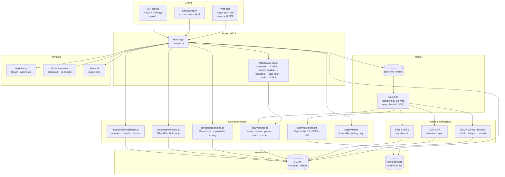

# CRA Compliance OS — architecture

How the system is put together, why it is put together that way, and what each
piece is allowed to assume. Written to be read by someone who has just cloned
the repository.

---

## 1. The one-paragraph version

A developer connects a repository. We fetch or receive its source, parse every
manifest into a normalised component model, publish that as CycloneDX, match it
against OSV / GitHub Advisory / CISA KEV / EPSS, evaluate 35 CRA controls
against the result, store the artefacts as tamper-evident evidence, and turn the
whole thing into a readiness score with reasons, an Article 14 incident workflow
and exportable reports. Every billable action is metered through a durable
credit ledger. Two processes run: an HTTP API and a worker. One SQLite database,
one object store.

---

## 2. System diagram



---

## 3. Processes and responsibilities

| Process | Entry point | Does | Must never do |
|---|---|---|---|
| **API** | `apps/api/src/index.ts` | Migrations → seed → (optional in-process worker) → serve static frontend + `/api/v1` | Run a scan inline; block on long work |
| **Worker** | `apps/api/src/worker-entry.ts` | Poll the queue, claim jobs, execute handlers, settle usage | Serve HTTP |

They share the database, so **the queue is the database**: `jobs` is a table with
status, attempts, `run_at`, progress and `result_json`, and `claimNext()` takes a
row transactionally. That means no Redis, no broker, no second source of truth
to keep in sync — and the queue survives a restart because it is durable.

At current scale (one node, jobs measured in seconds) this is the correct
choice. It also degrades gracefully: `jobs` maps cleanly onto Cloudflare Queues
later, because the handler signature `(jobId, payload)` is already the consumer
contract.

---

## 4. Request lifecycle

```
request → compress → CORS → secure headers (CSP, HSTS, XFO, nosniff)
        → request id + timing → rate limit (per IP + per key/user)
        → resolveAuth (session cookie | API key | none)
        → csrfGuard (browser-originated state changes only)
        → route handler → requireOrg / requireRole
        → module → database → envelope { data } | { error }
```

Three things are enforced in middleware and cannot be opted out of per route:
rate limiting, authentication resolution and CSRF. Authorisation is explicit at
the route: `requireOrg()` then `requireRole('admin')`.

**Tenant isolation** is a property of the data access layer, not of
remembering to add a `WHERE` clause. Every query that touches tenant data is
scoped by `orgId`, and cross-tenant reads return 404 rather than 403 for
resources that exist — so a scan id cannot be probed across organisations. If
the `X-Organization-Id` header and the `:orgId` in the URL disagree, the
request is refused with 403.

---

## 5. The scan pipeline

This is the core of the product, so it is worth being precise.

```
1. Acquire     GitHub tarball (App installation token) or uploaded .tar.gz
               ── validated by gzip magic bytes, size-capped at MAX_UPLOAD_BYTES
2. Extract     tar-stream, with per-file and total byte ceilings and path
               traversal rejection. Nothing is ever executed.
3. Discover    manifests.ts matches lockfiles and manifests by path/depth
4. Parse       parsers.ts → normalised components (name, version, ecosystem,
               purl, group, scope, direct/transitive, licences)
5. Normalise   dedupe by (ecosystem, name, version); build the dependency graph
6. Fingerprint hash of the resolved inventory — an unchanged repository is
               never charged (the reservation is released)
7. Match       OSV /v1/querybatch, deduped by coordinate, chunked at 100,
               4 attempts with exponential backoff
8. Enrich      CVSS base score computed from the vector, EPSS score and
               percentile, KEV membership + due date
9. Evaluate    compliance engine: 35 controls → status, score, rationale,
               evidence, remediation
10. Store      components, findings, SBOM (CycloneDX 1.6), evidence rows with
               sha256, scan summary counters
11. Settle     credits: reservation → commit (or release on failure/skip)
12. Notify     notifications, webhook deliveries, analytics event
```

Ecosystems with real parsers: **npm** (`package-lock.json`, `yarn.lock`,
`pnpm-lock.yaml`), **Python** (`requirements*.txt`, `poetry.lock`,
`pyproject.toml`), **Go** (`go.mod`, `go.sum`), **Rust** (`Cargo.lock`,
`Cargo.toml`), **Java** (`pom.xml`, Gradle `group:name:version`), **PHP**
(`composer.lock`, `composer.json`), **.NET** (`packages.lock.json`, `.csproj`),
**Ruby** (`Gemfile.lock`), plus Dockerfile base images. `package.json` alone
without a lockfile still produces an inventory — it is marked as an inventory
rather than a resolved dependency set, because that is the honest answer.

**Progress is real.** `progress(jobId, pct, message)` writes to `jobs` and
`job_events`; the frontend polls `GET /scans/:id/status` and renders whatever
the backend last said. There is no simulated progress anywhere in the codebase.

---

## 6. Data model in three sentences

Organisations own projects and repositories; repositories have scans; scans
produce components, findings, an SBOM and compliance assessments; assessments
reference controls and evidence; incidents hang off findings and carry
regulatory clocks; all billable work flows through a credit ledger whose
balance is the arithmetic sum of its transactions. See
[`SCHEMA.md`](SCHEMA.md) for the table-by-table version.

---

## 7. The credit ledger

Money is the part of a compliance product that must never be approximately
right, so it is the most conservative code in the system.

- `credit_accounts.balance` is a **materialised sum** of `credit_transactions`,
  maintained inside the same transaction that writes the row, with a `revision`
  counter guarding against lost updates.
- Billable work is **reserved before it runs** and **committed or released
  after**. A crashed job releases its reservation rather than silently charging.
- Every write carries an **idempotency key** with a unique index, so a retried
  webhook or a double-clicked button cannot double-charge.
- `GET /organizations/:orgId/billing/integrity` recomputes the balance from the
  transaction log and compares. It is asserted in the test suite and in
  `scripts/smoke.sh`.
- Balance checks are authoritative server-side. Running out of credits returns
  `402 insufficient_credits` with the price of what was attempted — the frontend
  never decides whether you can afford something.

Payment providers sit behind an interface (`modules/billing/providers/`), so
Dodo Payments (merchant of record) is the default and Stripe or Paddle can be
added without touching the ledger. Webhooks are verified against the Standard
Webhooks signature before anything is applied; an unverified webhook is a 401
and nothing else.

---

## 8. AI, and where it stops

`ai/provider.ts` supports `none` (default), `workers-ai`, `openai` and
`anthropic`. AI is used for exactly three things: summarising data we already
have, drafting report text from that data, and classifying uploaded evidence
against controls.

Three rules are enforced in code, not in policy:

1. Every AI output stores `sourcesJson` — the exact rows it was derived from —
   plus the model name and a confidence value.
2. Compliance **statuses are never produced by a model.** They come from the
   deterministic engine. A model may explain a status, never assign one.
3. With `AI_PROVIDER=none` the product is complete. Nothing is gated on a key,
   and no feature silently degrades into a placeholder.

Incident drafts are labelled "Draft — engineering evidence, not legal advice"
in their generated text, and that sentence is asserted by the smoke test.

---

## 9. Security posture

| Concern | Implementation |
|---|---|
| Secrets at rest | GitHub tokens and webhook secrets encrypted AES-256-GCM with `ENCRYPTION_KEY` |
| Passwords | scrypt with per-user salt; magic links and sessions stored as hashes |
| Signatures | GitHub App webhooks (HMAC-SHA256, timing-safe) and Dodo webhooks (Standard Webhooks) verified before any processing |
| SSRF | Outbound fetch targets are restricted to the configured provider hosts; user-supplied URLs are never fetched by the server |
| Repo access | Least privilege: GitHub App requests read-only contents and metadata; repository code is never executed |
| Uploads | Magic-byte validated, size-capped, extracted under byte and file-count limits, path traversal rejected |
| Transport | CSP, `X-Frame-Options: DENY`, `nosniff`, HSTS in production, `Permissions-Policy`, referrer policy |
| CSRF | Double-submit guard on browser-originated state changes |
| Audit | `audit_logs` records actor, action, target, IP and metadata for security-relevant actions |
| Isolation | Organisation scoping at the data layer; header/URL mismatch refused |

---

## 10. Observability

- **Structured JSON logs** via `core/logger.ts`, with request ids.
- `GET /health` (liveness), `GET /api/v1/health/detailed` (database latency,
  table count, storage state, queue depth), `GET /api/v1/admin/health`
  (operational view).
- `system_events` records levels and sources for operator-visible problems.
- Queue depth is the metric that matters: if it grows monotonically, the worker
  has stopped.
- `analytics_events` records the product funnel (signup → connect → scan →
  report → purchase) for the founder dashboard at
  `GET /api/v1/admin/funnel`.

---

## 11. Design decisions worth knowing

| Decision | Alternative rejected | Why |
|---|---|---|
| SQLite over Postgres | Managed Postgres | Correctness first. One file, zero cost, real transactions, no network. The data access layer is Drizzle, so the port is mechanical when volume justifies it. |
| Database-backed queue | Redis / BullMQ / Cloudflare Queues | No second system to keep consistent, no extra cost, jobs survive restarts, and the handler contract is already queue-shaped for a later port. |
| Node + Hono over Cloudflare Workers from day one | Workers + D1 | The Workers port is a real option and the app layer is runtime-agnostic by design — but debuggability and better-sqlite3's synchronous correctness beat edge latency before product-market fit. |
| Credits, not seats | Per-seat SaaS | Aligns price with the value actually delivered (scans and reports), keeps a solo developer's first sale cheap, and expands naturally with usage. |
| CycloneDX as canonical SBOM | SPDX | CycloneDX is what vulnerability tooling consumes, and it carries component + licence + dependency graph in one document. |
| Deterministic compliance engine, AI only for prose | Model-scored compliance | A score a customer cannot audit is worthless in a compliance context, and a model that invents a compliance fact is a liability. |
| One repo, two workspaces | Separate services | Solo operator. Deploys are one artifact; splitting is a scaling move, not an architecture move. |

---

## 12. Scaling path (in this order)

1. **Worker out of process** — already supported; set
   `RUN_WORKER_IN_PROCESS=false` and run `npm run worker`.
2. **Read replicas aren't needed yet** — move to a bigger single node. SQLite
   handles far more than this workload at this stage.
3. **Postgres + S3/R2** — swap the Drizzle driver and the storage driver; both
   are behind interfaces.
4. **Cloudflare Workers + D1 + R2 + Queues** — `src/app.ts` is already
   runtime-agnostic; the work is in `core/storage.ts`, `db/index.ts` and
   `jobs/queue.ts`. See the Cloudflare section of the roadmap.

Correctness first, security second, developer experience third, scalability
fourth, cost fifth. That ordering is deliberate and it is why step 1 is the only
one that should happen before revenue.

---

## 13. Repository map

```
apps/api/src/
  app.ts            HTTP assembly, middleware, route mounting
  index.ts          Node entrypoint (migrate → seed → serve)
  worker-entry.ts   Worker process entrypoint
  env.ts            Zod-validated configuration, production secret gate
  core/             auth, session, crypto, storage, audit, rate limit, errors, ids, mail
  db/               schema, migrations, seed
  scan/             source acquisition, manifest discovery, parsers, pipeline
  sbom/             CycloneDX serialisation
  intel/            OSV, KEV, EPSS, CVSS clients and normalisation
  compliance/       control catalogue, evaluation engine, estate rollups
  incidents/        Article 14 workflow and clocks
  modules/billing/  credit ledger, usage rules, payment providers
  jobs/             queue and worker
  routes/           HTTP handlers, grouped by resource
  ai/               provider abstraction with source traceability

apps/web/src/
  pages/            20 screens, lazy-loaded per route
  content/          long-form CRA reference guides (the SEO surface)
  components/       design primitives (ui.tsx), layout, errors
  lib/              api client, react-query hooks, formatting
```

---

## 14. API surface

Versioned under `/api/v1`. Machine-readable spec at
`GET /api/v1/openapi.json`, browsable at `GET /api/v1/docs`.

| Group | Representative endpoints |
|---|---|
| Auth | `POST /auth/signup`, `/login`, `/logout`, `/magic-link`, `GET /auth/github`, `GET /auth/me` |
| Organisations | `GET/POST /organizations`, members, invites, projects, API keys |
| Repositories | `GET/POST /organizations/:orgId/repositories`, `POST /…/scan`, `POST /organizations/:orgId/repositories/upload`, `GET /organizations/:orgId/scans/:id` |
| SBOM | `POST /organizations/:orgId/scans/:id/sbom`, `GET /organizations/:orgId/repositories/:id/sbom/latest` |
| Compliance | `GET /…/readiness` (org and repository), `GET /organizations/:orgId/controls`, `POST /…/assessments/:controlId/review`, evidence + evidence pack |
| Findings | `GET /organizations/:orgId/findings`, `POST /…/triage`, `GET /…/findings/:id` |
| Incidents | full Article 14 lifecycle: create, drafts, edit, approve, export, corrective measures, close |
| Reports | create, retrieve, share, revoke, delete |
| Billing | `GET /billing/pricing`, `GET /organizations/:orgId/billing` (+ ledger, usage, payments, integrity), `POST /…/checkout`, `POST /billing/webhooks/dodo` |
| Admin | overview, users, organisations, jobs, DLQ, credits, pricing, feature flags, funnel |
| Public | `/health`, `/health/detailed`, `/badge/:token`, `/share/:token`, `/analytics`, `/integrations/github/webhook` |
| CI | `POST /ci/scan`, `GET /ci/scan/:id`, `GET /ci/sbom/:id` |

Responses use a single envelope: `{ data: … }` on success,
`{ error: { code, message } }` on failure. Lists are paginated with `page` and
`perPage` (capped at 200) and return `{ items, total, page, perPage }`.
